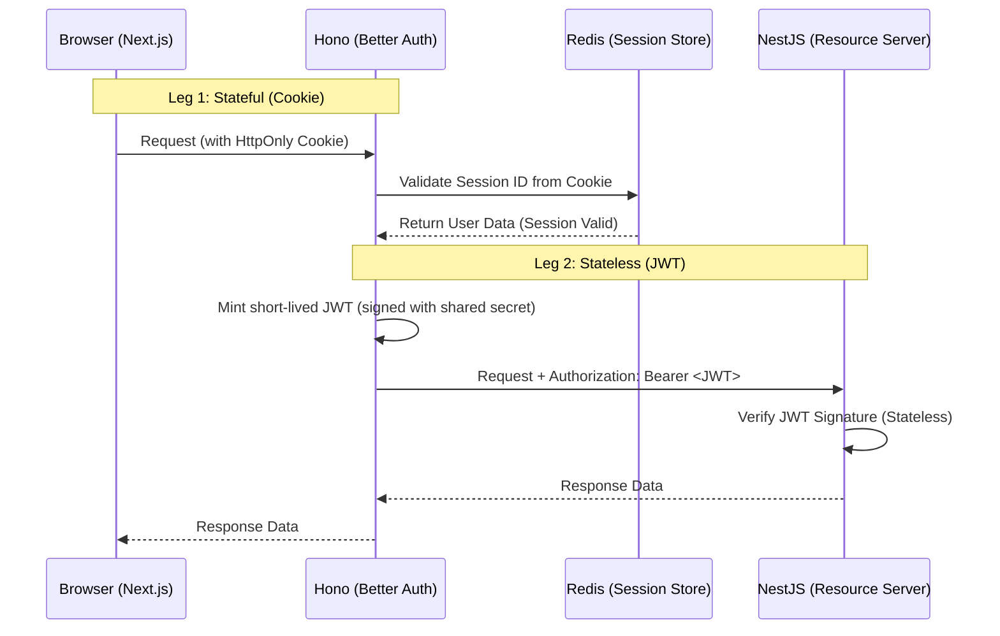

# Hybrid Authentication Strategy: Cookies & JWTs

For the architecture described (Next.js Frontend → Hono Proxy → NestJS Backend), the **Hybrid "BFF" (Backend for Frontend) Strategy** is the best choice. This approach splits your authentication into two distinct legs, optimizing for security on the client side and scalability on the backend side.

## The Recommendation: Hybrid Strategy

| Communication Leg                | Auth Mechanism            | Why?                                                                                             |
| -------------------------------- | ------------------------- | ------------------------------------------------------------------------------------------------ |
| **Next.js ↔ Hono (Proxy)**       | HttpOnly Session Cookies  | **Security**. Protects against XSS (JavaScript cannot read the cookie). Better Auth handles this natively. |
| **Hono (Proxy) ↔ NestJS (BE)**   | Short-lived JWT (Bearer)  | **Scalability**. NestJS remains stateless and doesn't need to do expensive session lookups for every request. |

## Architecture Diagram

This diagram shows how Hono acts as the "Translator" between the stateful browser and the stateless backend.

## Detailed Implementation Strategy

### 1. The Proxy Layer (Hono + Better Auth)

This is your "Auth Server." It holds the keys to the castle.

-   **Role**: Handles all "messy" auth logic: Social Sign-in redirects, setting cookies, and session management.
-   **Session Storage**: Use **Redis** here.
    -   **Why?** It’s fast and allows you to instantly revoke access (e.g., "Sign out all devices") by deleting the key in Redis. JWTs cannot do this easily.
-   **The "Translation" Middleware**: You need a custom Hono middleware that runs *after* Better Auth verifies the session but *before* the request is proxied to NestJS.
    1.  **Step A**: Verify the incoming cookie using Better Auth's `api.getSession`.
    2.  **Step B**: If valid, create a standardized JWT. This JWT should contain the `userId` and `roles`.
    3.  **Step C**: Sign this JWT with a private key (or shared secret) known only to Hono and NestJS.
    4.  **Step D**: Attach this as an `Authorization: Bearer <token>` header to the downstream request.

### 2. The Frontend Layer (Next.js)

-   **Role**: Dumb display. It does not handle JWTs directly.
-   **Strategy**: It only sees the `HttpOnly` cookie set by Hono.
-   **Social Sign-In**: The redirect URI for Google/GitHub should point to your Hono Proxy (e.g., `https://api.yoursite.com/api/auth/callback/google`), not the Next.js app. Hono will handle the callback, set the cookie, and redirect the user back to the Next.js frontend.

### 3. The Backend Layer (NestJS)

-   **Role**: Pure business logic.
-   **Strategy**: Stateless verification.
-   **JWT Guard**: Use the standard `@nestjs/passport` and `passport-jwt` strategy.
-   **Configuration**: Configure it to trust the public key (or shared secret) that Hono used to sign the token.
-   **Benefit**: Your NestJS services never need to talk to Redis or the Database to check if a user is logged in. They trust the token because they trust the signer (Hono).

### Why avoiding "Pass-Through" is crucial

Do **not** just pass the session cookie from Next.js to NestJS.

-   **Coupling**: If you pass the cookie, NestJS must understand your specific session implementation (Better Auth + Redis). If you change auth providers later, you have to refactor your entire backend.
-   **Performance**: If NestJS receives a cookie, it has to hit Redis to validate it. In a microservice setup, this creates a "chatty" architecture where every service hammers your Redis instance.

## Summary Checklist

-   [ ] **Better Auth Config**: Enable the Redis adapter in Better Auth on the Hono server.
-   [ ] **Cookie Settings**: Ensure `httpOnly: true`, `secure: true`, and `sameSite: 'lax'` (or `none` if on different subdomains).
-   [ ] **Token Minting**: In Hono, use a library like `jose` or `jsonwebtoken` to mint a token internally after session validation.
-   [ ] **Secret Management**: Ensure the signing secret is an environment variable shared only between Hono and NestJS (or use RS256 key pairs).
